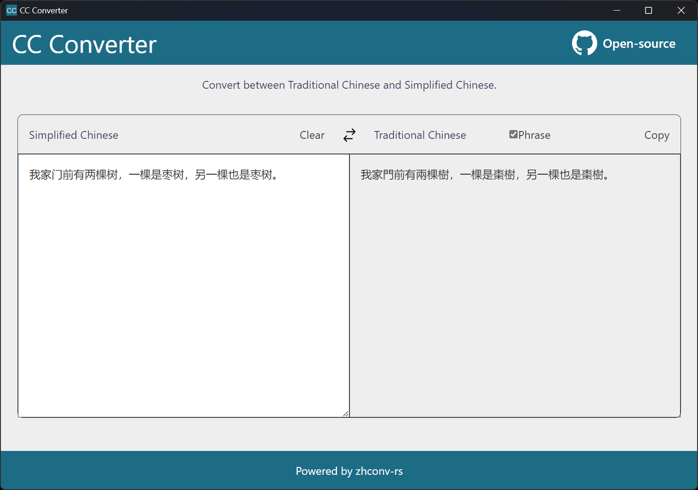

# CC Converter

Desktop App for conversion between traditional and simplified Chinese.

## Features

- Real-time conversion as you type.
- Translation of regional vocabulary (e.g. "軟體" -> "软件"). The vocabulary table in OpenCC is used. The "Phrase" option should be checked to enable this feature.

## TODO

- [ ] Allow user to define custom conversion rules
